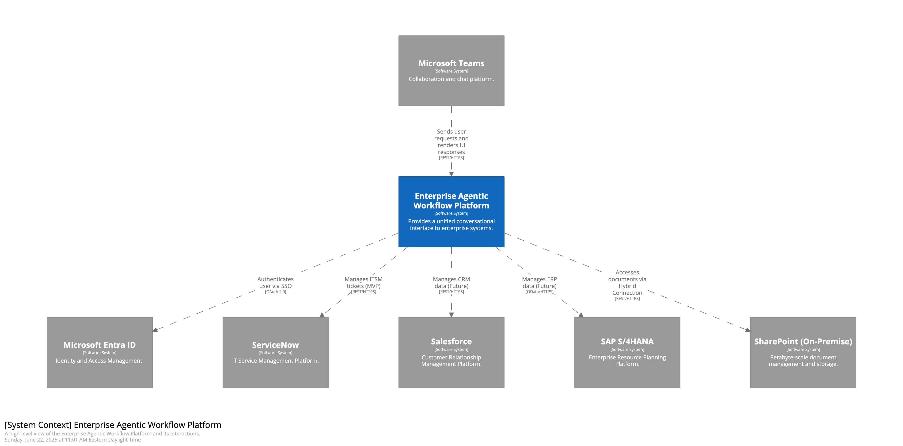
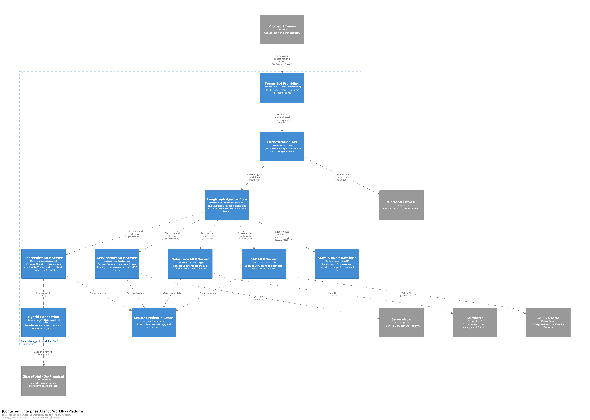
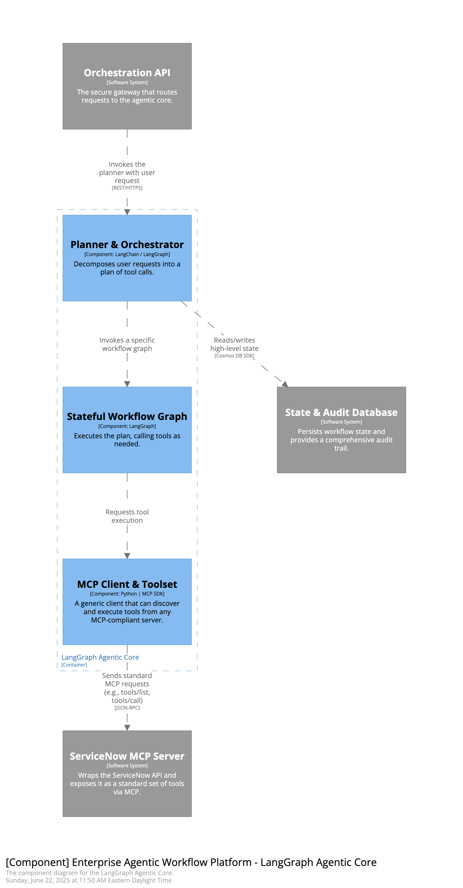

# Enterprise Agentic Workflow Platform

## High-Level Solution Architecture

### Document Purpose

This document provides a comprehensive architectural overview of the **Enterprise Agentic Workflow Platform**. Its purpose is to detail the technical design and implementation strategy for **replacing the existing Moveworks platform** with a proprietary, extensible, and financially sustainable solution.

The architecture is built upon the **Model Context Protocol (MCP)**, treating it as a first-class service to ensure a decoupled, scalable, and standards-based approach to all system integrations. The design is described using the **C4 model** to cater to various audiences.

### Document Structure

This documentation is organized into the following sections:

1.  **Introduction**: An overview of the platform's goals and its MCP-first architectural philosophy.
2.  **System Context Diagram (C4 Level 1)**: A high-level view of the system, its users, and its relationship with the broader enterprise ecosystem.
3.  **Container Diagram (C4 Level 2)**: A closer look at the major technical building blocks, including the MCP Server for ServiceNow.
4.  **Component Diagram (C4 Level 3)**: A detailed view of the internal components of the core agentic engine and its interaction with the MCP client.
5.  **Framework Selection**: The rationale behind selecting LangGraph as the foundational framework for agentic workflows.
6.  **Conversational Front-End Architecture**: The architecture of the Microsoft Teams conversational interface.
7.  **Future Integration Patterns**: The strategy for building dedicated MCP Servers for future integrations like Salesforce, SAP, and SharePoint.

---

# 1. Introduction

The **Enterprise Agentic Workflow Platform** is a custom-built solution designed to serve as the central, intelligent interface for all employee interactions with enterprise systems. It will be delivered through a conversational bot within Microsoft Teams, providing a single, unified touchpoint for automating tasks, retrieving information, and executing complex business processes.

The primary goal of this initiative is to execute a **full replacement of the Moveworks platform** to achieve two key objectives:

1.  **Reclaim Annual Spend:** Eliminate the significant recurring licensing costs associated with the third-party platform.
2.  **Establish Technological Sovereignty:** Build a proprietary, flexible, and future-proof asset that we own and control.

A foundational principle of this architecture is the adoption of the **Model Context Protocol (MCP)** as a first-class service. This standards-based approach ensures a truly decoupled system.

Our strategy balances build vs. buy. We will **build and own the core orchestration logic** within the `LangGraph Agentic Core`, as this represents our unique business value. For the system connectors, we will adopt a **"buy, then find, then build"** approach. We will actively seek out existing commercial or open-source **MCP Servers** for our target platforms (ServiceNow, Salesforce, etc.) to accelerate development and reduce maintenance overhead. This allows our small, focused team to concentrate on high-value workflow automation rather than on re-implementing commodity API connectors.

---

## 2. System Context Diagram (C4 Level 1)

### Description

This diagram provides the highest-level view of the system, treating the **Enterprise Agentic Workflow Platform** as a single entity. It illustrates how the platform fits into the existing enterprise ecosystem by showing its direct users and the primary external systems it interacts with. This view is intended for a broad audience, including senior leadership, to understand the platform's scope and strategic value.

- **Users:** Employees interact with the platform exclusively through Microsoft Teams.
- **Authentication:** Microsoft Entra ID (formerly Azure AD) is used to handle user authentication via Single Sign-On (SSO).
- **Integrations:** The platform is designed to connect to a variety of critical enterprise systems. The initial MVP will focus on replacing the existing **ServiceNow** integration. Future phases will expand to include **Salesforce**, **SAP S/4HANA**, and the **SharePoint (On-Premise)** farm.

---

## 3. Container Diagram (C4 Level 2)

### Description

This diagram reveals the high-level technical architecture of the platform. A key feature of this design is the use of the **Model Context Protocol (MCP)** to decouple the agent from its tools.

Instead of the `LangGraph Agentic Core` having direct, tightly-coupled knowledge of ServiceNow's API, it communicates with a dedicated **ServiceNow MCP Server**. This server exposes its capabilities (e.g., `create_ticket`, `get_ticket_status`) over the standard MCP protocol. This pattern will be replicated for all future integrations (Salesforce, SAP, etc.), ensuring a consistent, scalable, and maintainable architecture.

The key containers are:

1.  **Teams Bot Front-End:** The user-facing interface in Microsoft Teams.
2.  **Orchestration API:** The secure gateway that routes requests to the agentic core.
3.  **LangGraph Agentic Core:** The "brain" of the platform. It acts as an **MCP Host**, consuming tools exposed by MCP Servers.
4.  **ServiceNow MCP Server:** A new, dedicated service built for the MVP. It wraps the ServiceNow REST API and exposes it as a standard set of tools via the MCP protocol. This server is a self-contained, deployable unit.
5.  **Secure Credential Store (Azure Key Vault):** Stores credentials needed by the MCP Servers.
6.  **State & Audit Database (Azure Cosmos DB):** Persists workflow state for the Agentic Core.
7.  **Hybrid Connection:** The secure network tunnel to on-premise systems, to be used by future MCP servers (e.g., for SharePoint).

---

## 4. Component Diagram (C4 Level 3)

### Description

This diagram provides the most detailed view by zooming into the **LangGraph Agentic Core** container. It breaks the container down into its major logical components and is intended for the software developers and engineers who will build and maintain the system. This view clarifies the internal structure and responsibilities within the core application.

The key components are:

1.  **Planner & Orchestrator:** The entry point into the core. It receives a request from the API, uses a Large Language Model (LLM) to understand the user's intent, and selects the appropriate workflow graph to execute.
2.  **Stateful Workflow Graph:** An instance of a LangGraph `StateGraph`. Each graph represents a specific business process (e.g., ServiceNow ticketing). It defines the nodes (steps) and edges (logic) of the workflow, managing the state of the interaction from start to finish.
3.  **MCP Client & Toolset:** This component standardizes all interactions with external tools. Instead of containing system-specific logic (for ServiceNow, Salesforce, etc.), it is a generic client that speaks the **Model Context Protocol (MCP)**. At the start of a workflow, this client communicates with the relevant MCP Server to dynamically discover the tools it offers (via a `tools/list` request). When the graph needs to execute a tool, the client sends a standard `tools/call` request. This design completely decouples the Agentic Core from the implementation details of the external systems; the core only needs to know how to speak MCP.

---

## 5. Framework Selection: LangGraph

The core of the platform's intelligence lies in its ability to orchestrate complex, multi-step tasks. The choice of a framework to manage these agentic workflows is therefore a critical architectural decision. After evaluating leading frameworks, **LangGraph** is the recommended choice.

### Why LangGraph?

LangGraph, an extension of the popular LangChain ecosystem, is specifically designed for building stateful, multi-agent applications. Its graph-based structure is uniquely suited for the demands of enterprise automation.

- **Explicit Control and Auditability:** Workflows in LangGraph are defined as explicit graphs, where nodes are functions and edges represent the control flow. This "white-box" approach makes the logic easy to visualize, debug, and, most importantly, audit—a non-negotiable requirement for enterprise-grade financial, HR, or compliance workflows.
- **Stateful and Cyclical by Design:** Real-world business processes are rarely linear. They involve loops, retries, and waiting for external events. LangGraph is built to model these patterns natively, maintaining an explicit state object that is passed between nodes and supporting cycles in the graph.
- **Native Human-in-the-Loop (HITL):** LangGraph treats human oversight as a first-class citizen. The ability to define custom breakpoints within the graph that explicitly pause execution and wait for human approval is a core, built-in feature. This is critical for building trust and ensuring safety when automating high-stakes actions.
- **Ecosystem and Observability:** LangGraph benefits from the vast LangChain ecosystem of tools and integrations. Its native integration with LangSmith provides unparalleled capabilities for tracing, debugging, and monitoring agent behavior, which is essential for maintaining reliable production systems.

### Alternatives Considered

- **LlamaIndex:** While powerful, especially for Retrieval-Augmented Generation (RAG), its agentic workflow abstractions are more event-driven. For our purposes, the explicit graph structure of LangGraph provides superior control and auditability for complex business processes.
- **Microsoft Semantic Kernel:** A strong contender, particularly for its enterprise-grade security focus and native integration with the Azure ecosystem. However, LangGraph's more mature and explicit constructs for cyclical, stateful, multi-agent workflows make it a better fit for the complex orchestration this platform requires.

---

## 6. Conversational Front-End Architecture

The user's entire experience with the platform will be mediated through Microsoft Teams. Creating a seamless, secure, and intuitive conversational front-end is paramount to the project's success. The architecture will leverage Microsoft's native frameworks and adhere to established best practices.

### Core Components

The chatbot will be built using the **Microsoft Bot Framework SDK**, a comprehensive framework for building enterprise-grade conversational applications.

- **Azure Bot Service:** This managed Azure service will act as the central hub, registering the bot and connecting it to the Teams channel.
- **Web App Host:** The bot's logic is fundamentally a web service that will be hosted in Azure (e.g., Azure App Service or Azure Functions). This service exposes a secure messaging endpoint that the Azure Bot Service calls.
- **Teams Activity Handler:** The bot's code will use the `TeamsActivityHandler` class, a specialized extension of the standard activity handler. This allows the bot to natively receive and process Teams-specific events (like a user being added to a channel), enabling a richer, more integrated experience.

### Conversation Flow and State Management

A key architectural principle is the separation of concerns. The Teams bot will be a "thin client," responsible for UI and conversation management, while the backend Agentic Core handles the complex business logic.

- **State Management:** To have meaningful, multi-turn conversations, the bot must maintain state (e.g., remembering what question it just asked). We will use the Bot Framework's built-in state management capabilities, which can persist user and conversation state in a storage layer like Azure Blob Storage or Cosmos DB.
- **Dialogs:** For structured interactions, like guiding a user through filling out a form, we will use the Bot Framework's Dialogs library. `WaterfallDialogs` are particularly useful for defining a linear sequence of steps to gather information before invoking the backend agent.
- **Adaptive Cards:** All rich UI elements—including forms, buttons, and formatted results—will be rendered using Adaptive Cards. This ensures a native, interactive, and consistent user experience within the Teams client.

### Authentication with Single Sign-On (SSO)

To eliminate login friction, the bot will implement SSO using **Microsoft Entra ID** as the identity provider.

The SSO flow in Teams is designed to be nearly invisible to the user. When the bot needs an authenticated action, it requests a token. The Teams client, knowing the user is already logged in, can acquire an access token from Entra ID on the user's behalf and pass it back to the bot, often without the user ever seeing a login prompt. This is a standard, secure enterprise pattern that requires a one-time app registration and configuration in Azure.

---

## 7. Future Integration Patterns

Our platform's integration strategy is founded on the **Model Context Protocol (MCP)**. This allows us to treat system connectors as interchangeable components, giving us the flexibility to choose the most efficient path for each integration while prioritizing commercial support and reliability.

### The MCP Server: Buy, Find, or Build

For each new system, our approach will be:

1.  **Buy:** First, we will evaluate commercially available, enterprise-grade MCP Servers from certified vendors or major integration platform providers. A commercially supported solution is our preferred path as it guarantees reliability, security, and professional support, which is critical for core business systems.
2.  **Find:** If a suitable commercial product is not available or is not cost-effective, our second option is to search the open-source ecosystem. A well-maintained open-source project can serve as a strong foundation, particularly if we anticipate needing to fork and extend its functionality to meet our specific needs.
3.  **Build:** If neither of the above options meets our security and feature requirements, we will use the official MCP SDKs to build our own lightweight, custom MCP Server. This is our fallback option, ensuring we are never blocked by the market's maturity.

This pragmatic approach allows us to maintain architectural purity while making sound economic and risk-management decisions for each new integration.

### Integration Roadmap

Our integration plan is based on a current market analysis of the Model Context Protocol (MCP) ecosystem and applies our "Buy, Find, Build" strategy to each target platform.

1.  **ServiceNow (MVP):** A targeted market scan shows a lack of mature, off-the-shelf commercial MCP servers for ServiceNow at this time. However, a promising, feature-rich **open-source server** (`servicenow-mcp` on GitHub) has been identified. Therefore, our MVP will proceed by prioritizing the "Find" step:
    * **Action:** The first phase of the MVP will be to rigorously evaluate the existing open-source server. We will deploy it in a development environment to validate its security, performance, and feature coverage against our specific ticketing and approval requirements. If it proves viable, we will adopt it, significantly accelerating our timeline. If it is not suitable, we will proceed directly to the "Build" phase and create our own lightweight `ServiceNow MCP Server`.

2.  **Salesforce:** In contrast to ServiceNow, the market for Salesforce integration includes multiple **commercial** MCP offerings from enterprise software vendors and iPaaS providers.
    * **Action:** When this integration is prioritized, our strategy will be to **Buy**. We will conduct a formal evaluation and bake-off of these commercial products to select the most suitable one.

3.  **SAP S/4HANA:** The ecosystem for SAP ERP integration via MCP remains nascent, with no mature commercial or open-source servers readily available for specific business logic.
    * **Action:** We will provision for this integration to be a **Build** effort. The plan is to develop a custom `SAP MCP Server` in-house, wrapping the necessary OData APIs for our required workflows.

4.  **On-Premise SharePoint:** This remains a **Build** scenario due to the custom nature of the required hybrid connectivity and the need to interact with the on-premise Search API.

### Future Architectural Patterns: Multi-Agent Collaboration

As the platform matures and is tasked with automating increasingly complex, cross-functional business processes (e.g., employee onboarding, supply chain exceptions), we will evolve from a single-agent architecture to a **multi-agent communication (A2A) model**.

This involves creating a "society of agents" where our central `LangGraph Agentic Core` acts as an **Orchestrator Agent**. It will delegate complex sub-tasks to specialized, subordinate agents, such as:

-   An **IT Operations Agent**, with deep expertise in ServiceNow and infrastructure tools.
-   A **Sales Operations Agent**, with expert knowledge of Salesforce objects and processes.
-   A **Finance & Procurement Agent**, which is the sole entity authorized to interact with SAP.

This federated model allows us to scale the platform's capabilities indefinitely. Each specialized agent can be developed, maintained, and secured by the teams who are experts in that domain. Our choice of LangGraph as the core framework natively supports this evolution, as one agent can be defined as a "tool" to be called by another, enabling sophisticated hierarchical and collaborative workflows. This ensures the platform can grow in intelligence and scope to meet any future business need.